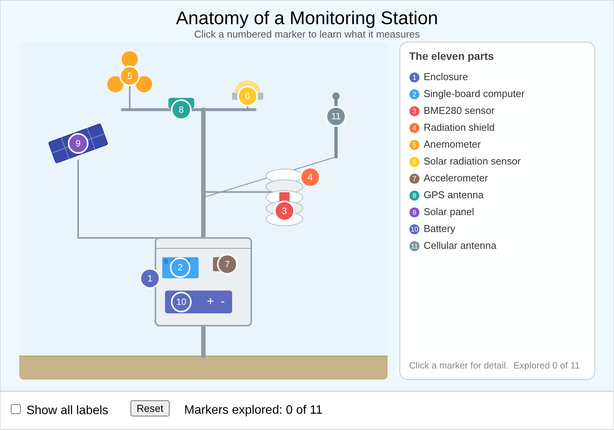
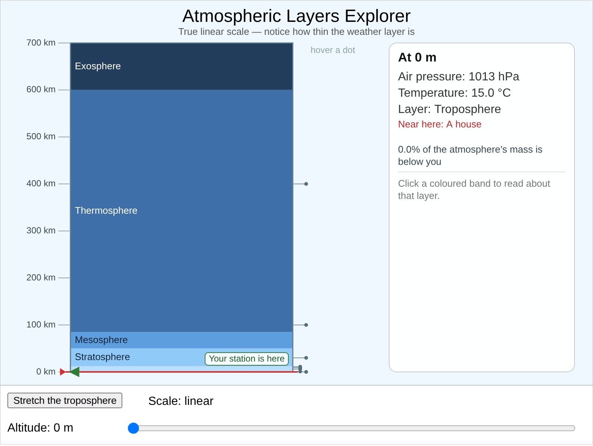
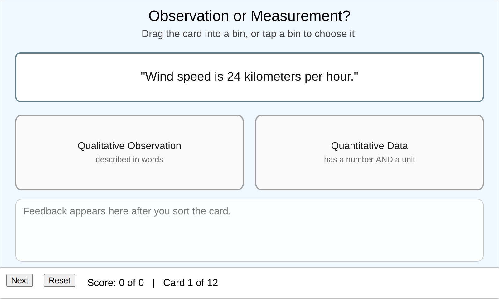
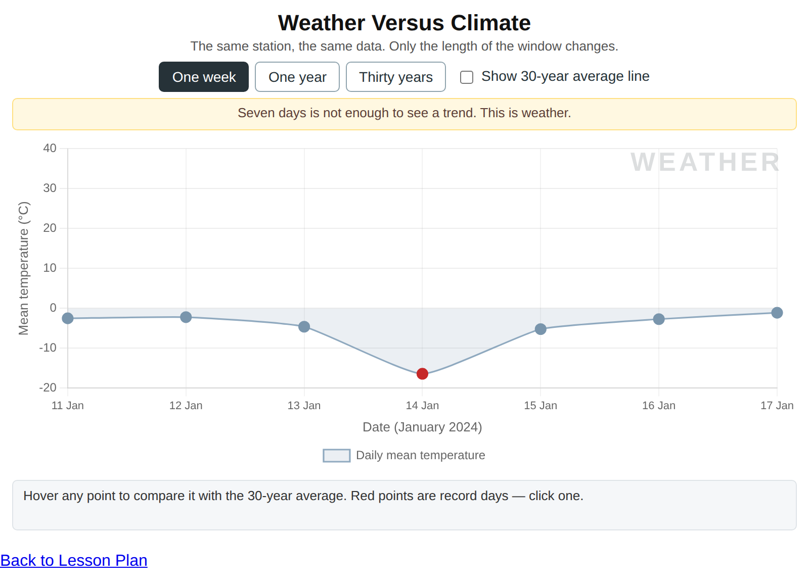

# MicroSims

This book includes **4 interactive MicroSims** — self-contained, browser-based visualizations you can explore directly. Click any thumbnail to open the MicroSim.

<!-- This gallery is generated by generate-sims-index.py — edits here will be overwritten. -->

  <a href="monitoring-station-anatomy/" title="Anatomy of an Environmental Monitoring Station" style="display:block;border:1px solid #e3e7ec;border-radius:8px;overflow:hidden;text-decoration:none;color:inherit;box-shadow:0 1px 3px rgba(0,0,0,0.08);">Anatomy of an Environmental Monitoring Station</a>
  <a href="atmospheric-layers-explorer/" title="Atmospheric Layers Explorer" style="display:block;border:1px solid #e3e7ec;border-radius:8px;overflow:hidden;text-decoration:none;color:inherit;box-shadow:0 1px 3px rgba(0,0,0,0.08);">Atmospheric Layers Explorer</a>
  <a href="observation-or-measurement-sorter/" title="Observation or Measurement Sorter" style="display:block;border:1px solid #e3e7ec;border-radius:8px;overflow:hidden;text-decoration:none;color:inherit;box-shadow:0 1px 3px rgba(0,0,0,0.08);">Observation or Measurement Sorter</a>
  <a href="weather-versus-climate-explorer/" title="Weather Versus Climate Explorer" style="display:block;border:1px solid #e3e7ec;border-radius:8px;overflow:hidden;text-decoration:none;color:inherit;box-shadow:0 1px 3px rgba(0,0,0,0.08);">Weather Versus Climate Explorer</a>

