# MicroSims

This book includes **38 interactive MicroSims** — self-contained, browser-based visualizations you can explore directly. Click any thumbnail to open the MicroSim.

<!-- This gallery is generated by generate-sims-index.py — edits here will be overwritten. -->

  <a href="accuracy-versus-precision-targets/" title="Accuracy Versus Precision Target Range" style="display:block;border:1px solid #e3e7ec;border-radius:8px;overflow:hidden;text-decoration:none;color:inherit;box-shadow:0 1px 3px rgba(0,0,0,0.08);">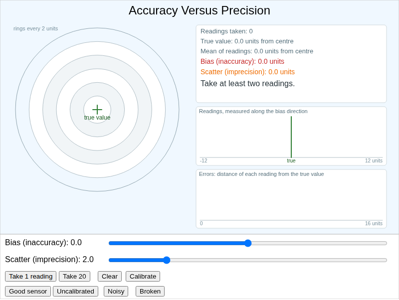Accuracy Versus Precision Target Range</a>
  <a href="analog-to-digital-stepthrough/" title="Analog to Digital Conversion Step-Through" style="display:block;border:1px solid #e3e7ec;border-radius:8px;overflow:hidden;text-decoration:none;color:inherit;box-shadow:0 1px 3px rgba(0,0,0,0.08);">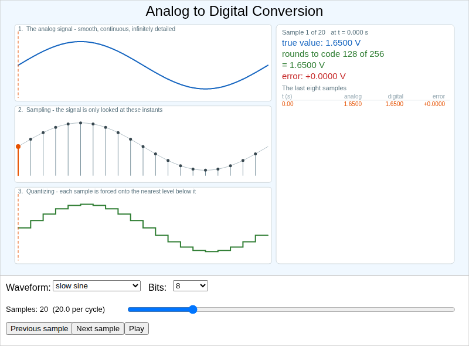Analog to Digital Conversion Step-Through</a>
  <a href="monitoring-station-anatomy/" title="Anatomy of an Environmental Monitoring Station" style="display:block;border:1px solid #e3e7ec;border-radius:8px;overflow:hidden;text-decoration:none;color:inherit;box-shadow:0 1px 3px rgba(0,0,0,0.08);">Anatomy of an Environmental Monitoring Station</a>
  <a href="apparent-temperature-explorer/" title="Apparent Temperature Explorer" style="display:block;border:1px solid #e3e7ec;border-radius:8px;overflow:hidden;text-decoration:none;color:inherit;box-shadow:0 1px 3px rgba(0,0,0,0.08);">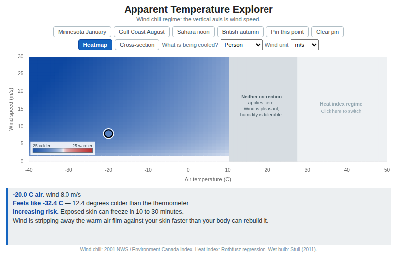Apparent Temperature Explorer</a>
  <a href="atmospheric-layers-explorer/" title="Atmospheric Layers Explorer" style="display:block;border:1px solid #e3e7ec;border-radius:8px;overflow:hidden;text-decoration:none;color:inherit;box-shadow:0 1px 3px rgba(0,0,0,0.08);">Atmospheric Layers Explorer</a>
  <a href="beaufort-observation-trainer/" title="Beaufort Scale Observation Trainer" style="display:block;border:1px solid #e3e7ec;border-radius:8px;overflow:hidden;text-decoration:none;color:inherit;box-shadow:0 1px 3px rgba(0,0,0,0.08);">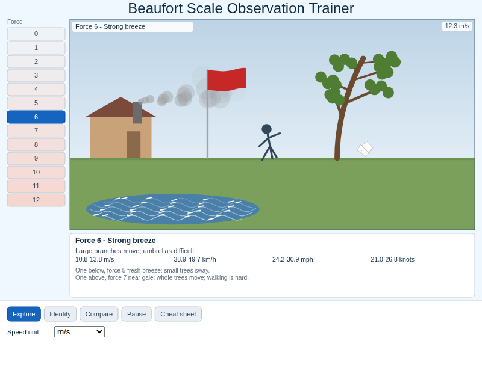Beaufort Scale Observation Trainer</a>
  <a href="breadboard-connection-explorer/" title="Breadboard Connection Explorer" style="display:block;border:1px solid #e3e7ec;border-radius:8px;overflow:hidden;text-decoration:none;color:inherit;box-shadow:0 1px 3px rgba(0,0,0,0.08);">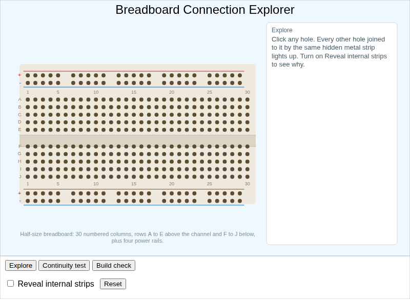Breadboard Connection Explorer</a>
  <a href="circuit-loop-explorer/" title="Circuit Loop and the Missing Ground" style="display:block;border:1px solid #e3e7ec;border-radius:8px;overflow:hidden;text-decoration:none;color:inherit;box-shadow:0 1px 3px rgba(0,0,0,0.08);">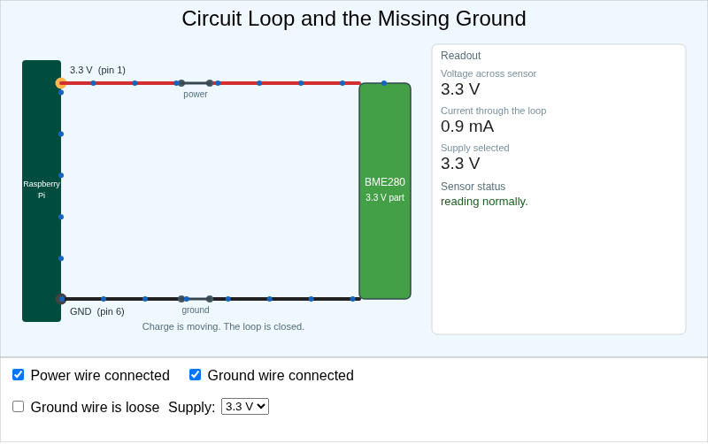Circuit Loop and the Missing Ground</a>
  <a href="command-line-sandbox/" title="Command Line Sandbox" style="display:block;border:1px solid #e3e7ec;border-radius:8px;overflow:hidden;text-decoration:none;color:inherit;box-shadow:0 1px 3px rgba(0,0,0,0.08);">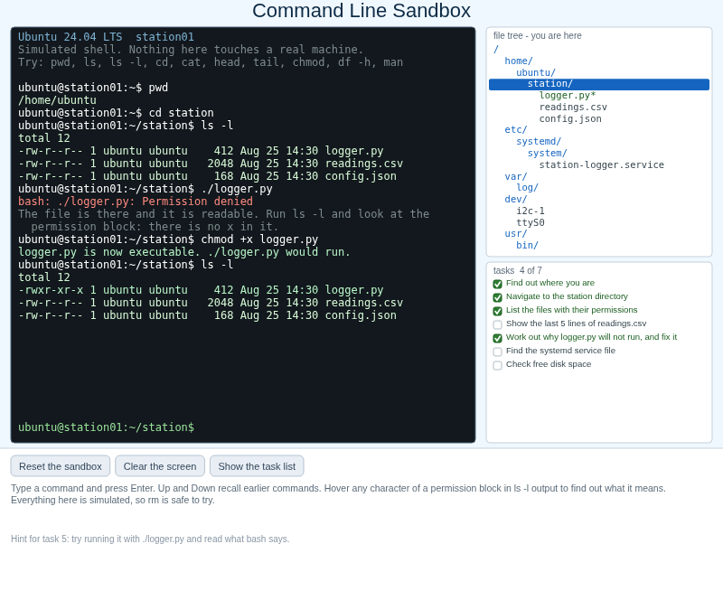Command Line Sandbox</a>
  <a href="early-warning-race/" title="Early Warning Race - P Wave Versus Alert" style="display:block;border:1px solid #e3e7ec;border-radius:8px;overflow:hidden;text-decoration:none;color:inherit;box-shadow:0 1px 3px rgba(0,0,0,0.08);">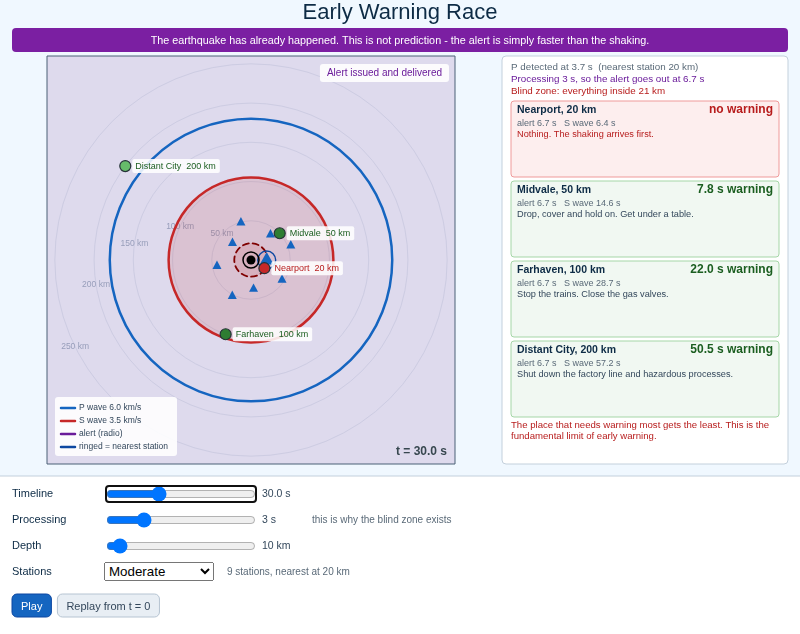Early Warning Race - P Wave Versus Alert</a>
  <a href="falling-barometer-forecast/" title="Falling Barometer Forecast Trainer" style="display:block;border:1px solid #e3e7ec;border-radius:8px;overflow:hidden;text-decoration:none;color:inherit;box-shadow:0 1px 3px rgba(0,0,0,0.08);">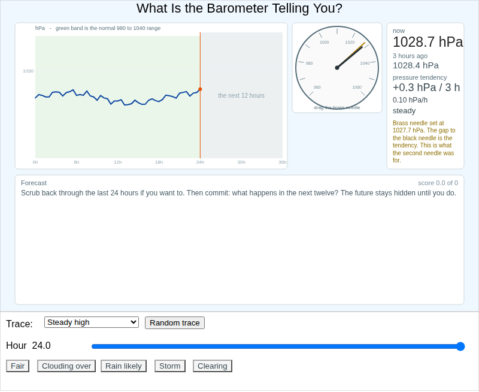Falling Barometer Forecast Trainer</a>
  <a href="fog-watch-convergence/" title="Fog Watch: Temperature and Dew Point Convergence" style="display:block;border:1px solid #e3e7ec;border-radius:8px;overflow:hidden;text-decoration:none;color:inherit;box-shadow:0 1px 3px rgba(0,0,0,0.08);">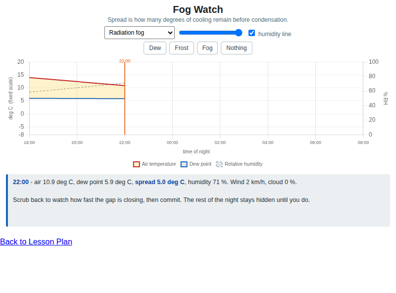Fog Watch: Temperature and Dew Point Convergence</a>
  <a href="gps-trilateration-explorer/" title="GPS Trilateration Explorer" style="display:block;border:1px solid #e3e7ec;border-radius:8px;overflow:hidden;text-decoration:none;color:inherit;box-shadow:0 1px 3px rgba(0,0,0,0.08);">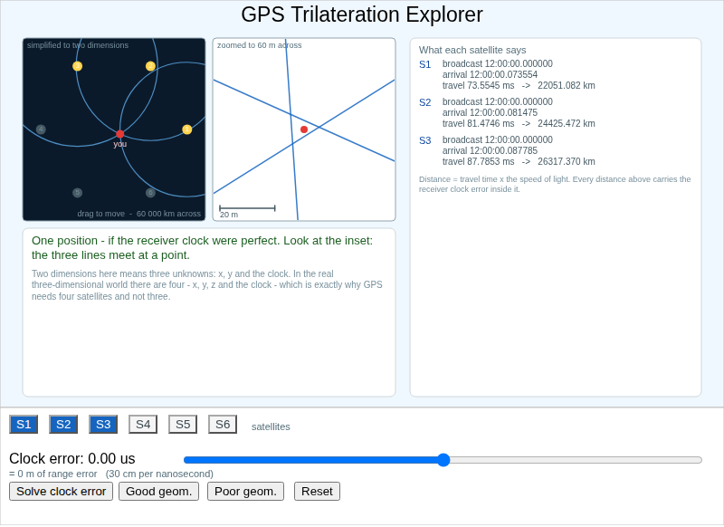GPS Trilateration Explorer</a>
  <a href="humidity-three-ways/" title="Humidity, Three Ways" style="display:block;border:1px solid #e3e7ec;border-radius:8px;overflow:hidden;text-decoration:none;color:inherit;box-shadow:0 1px 3px rgba(0,0,0,0.08);">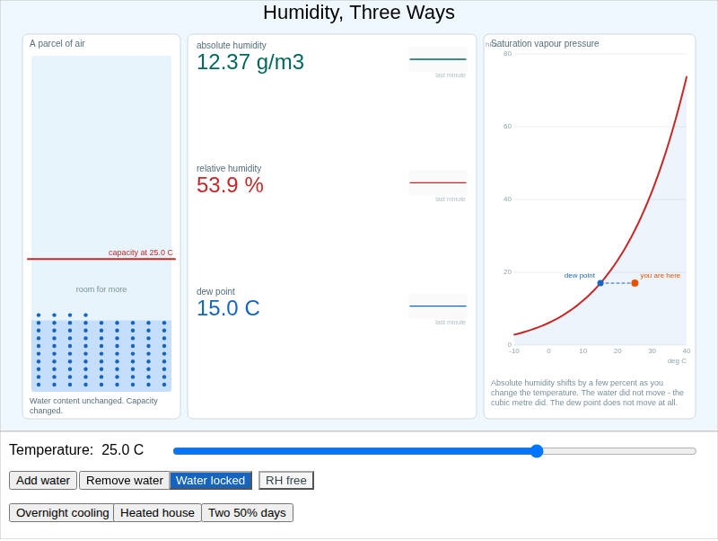Humidity, Three Ways</a>
  <a href="i2c-bus-explorer/" title="I2C Bus Explorer" style="display:block;border:1px solid #e3e7ec;border-radius:8px;overflow:hidden;text-decoration:none;color:inherit;box-shadow:0 1px 3px rgba(0,0,0,0.08);">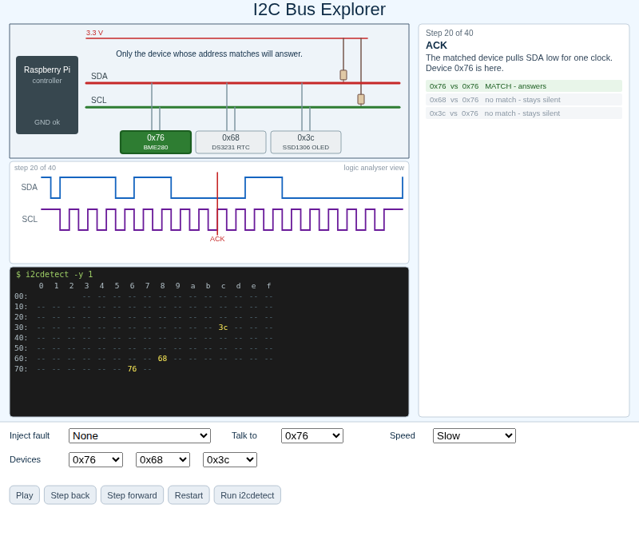I2C Bus Explorer</a>
  <a href="inertial-mass-seismometer/" title="Inertial Mass Seismometer" style="display:block;border:1px solid #e3e7ec;border-radius:8px;overflow:hidden;text-decoration:none;color:inherit;box-shadow:0 1px 3px rgba(0,0,0,0.08);">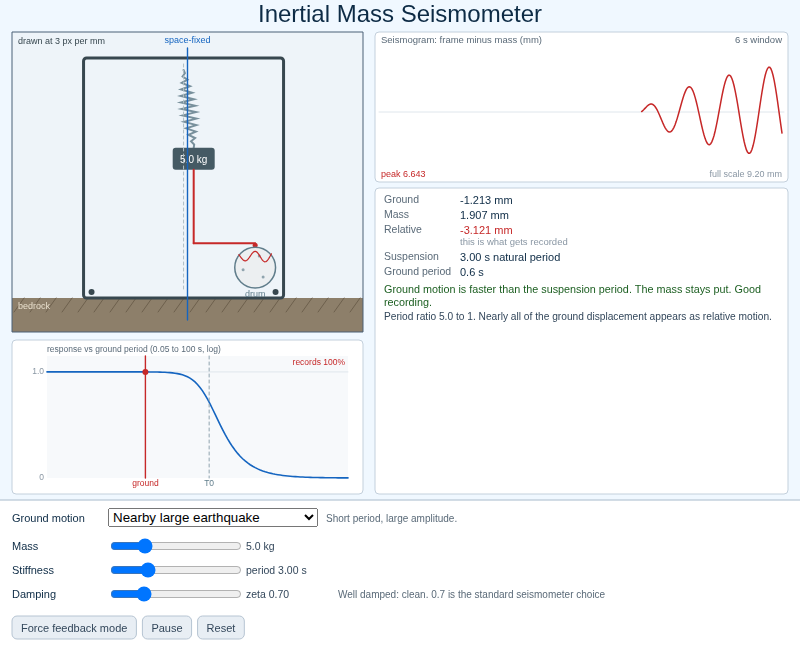Inertial Mass Seismometer</a>
  <a href="inside-the-bme280/" title="Inside the BME280" style="display:block;border:1px solid #e3e7ec;border-radius:8px;overflow:hidden;text-decoration:none;color:inherit;box-shadow:0 1px 3px rgba(0,0,0,0.08);">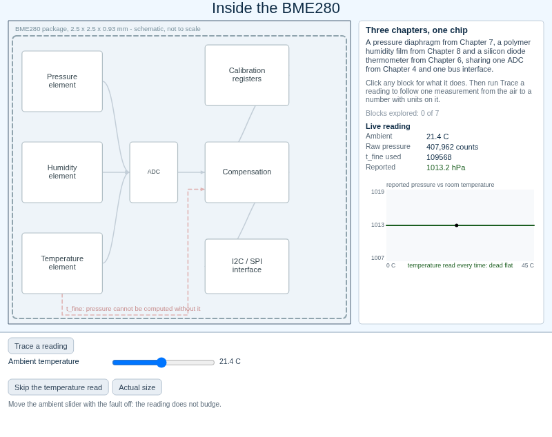Inside the BME280</a>
  <a href="linear-versus-log-scale/" title="Linear Versus Logarithmic Scale" style="display:block;border:1px solid #e3e7ec;border-radius:8px;overflow:hidden;text-decoration:none;color:inherit;box-shadow:0 1px 3px rgba(0,0,0,0.08);">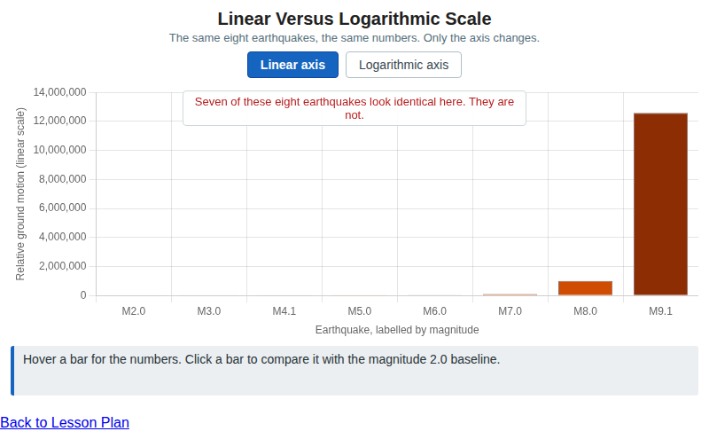Linear Versus Logarithmic Scale</a>
  <a href="magnitude-versus-intensity-map/" title="Magnitude Versus Intensity Map" style="display:block;border:1px solid #e3e7ec;border-radius:8px;overflow:hidden;text-decoration:none;color:inherit;box-shadow:0 1px 3px rgba(0,0,0,0.08);">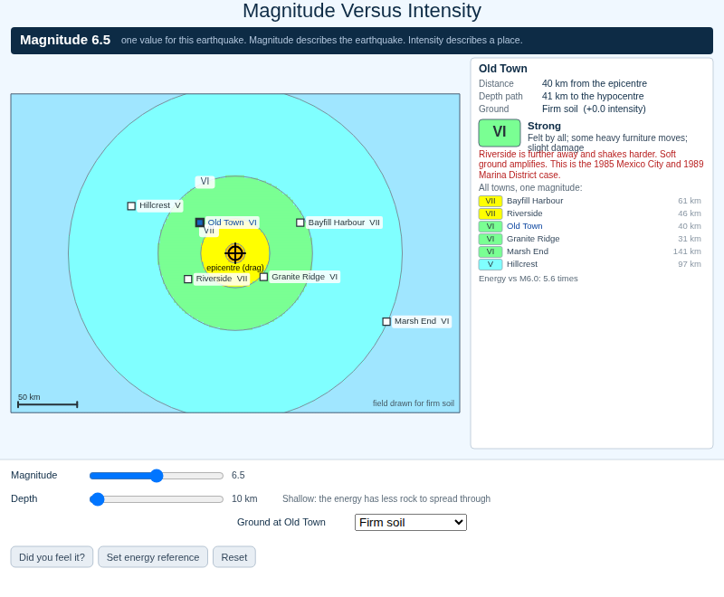Magnitude Versus Intensity Map</a>
  <a href="noise-and-averaging-bench/" title="Noise and Averaging Bench" style="display:block;border:1px solid #e3e7ec;border-radius:8px;overflow:hidden;text-decoration:none;color:inherit;box-shadow:0 1px 3px rgba(0,0,0,0.08);">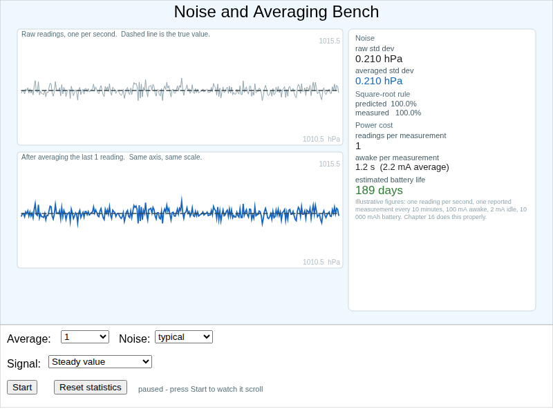Noise and Averaging Bench</a>
  <a href="observation-or-measurement-sorter/" title="Observation or Measurement Sorter" style="display:block;border:1px solid #e3e7ec;border-radius:8px;overflow:hidden;text-decoration:none;color:inherit;box-shadow:0 1px 3px rgba(0,0,0,0.08);">Observation or Measurement Sorter</a>
  <a href="pressure-altitude-calculator/" title="Pressure and Altitude Calculator" style="display:block;border:1px solid #e3e7ec;border-radius:8px;overflow:hidden;text-decoration:none;color:inherit;box-shadow:0 1px 3px rgba(0,0,0,0.08);">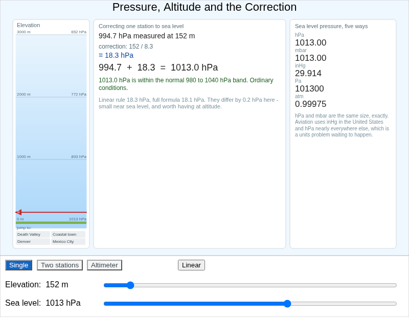Pressure and Altitude Calculator</a>
  <a href="pressure-gradient-wind-map/" title="Pressure Gradient Wind Map" style="display:block;border:1px solid #e3e7ec;border-radius:8px;overflow:hidden;text-decoration:none;color:inherit;box-shadow:0 1px 3px rgba(0,0,0,0.08);">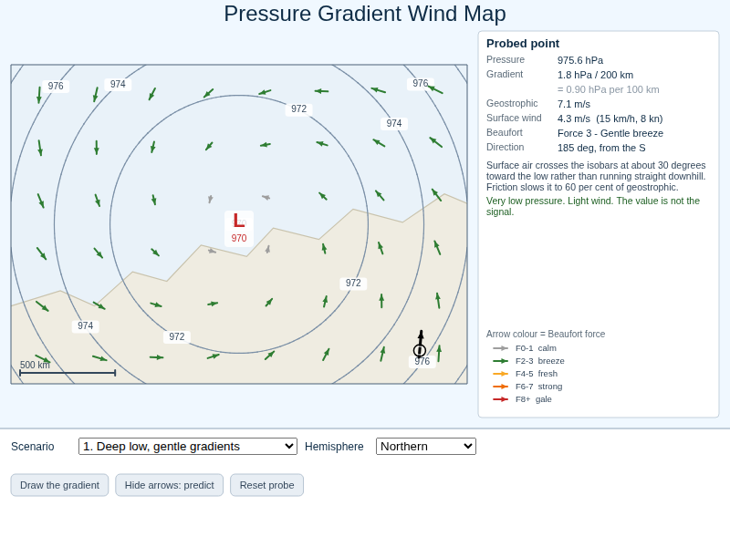Pressure Gradient Wind Map</a>
  <a href="psychrometer-wet-bulb-bench/" title="Psychrometer Wet Bulb Bench" style="display:block;border:1px solid #e3e7ec;border-radius:8px;overflow:hidden;text-decoration:none;color:inherit;box-shadow:0 1px 3px rgba(0,0,0,0.08);">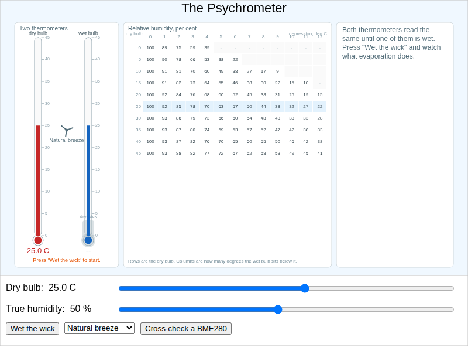Psychrometer Wet Bulb Bench</a>
  <a href="radiation-shield-lab/" title="Radiation Shield Comparison Lab" style="display:block;border:1px solid #e3e7ec;border-radius:8px;overflow:hidden;text-decoration:none;color:inherit;box-shadow:0 1px 3px rgba(0,0,0,0.08);">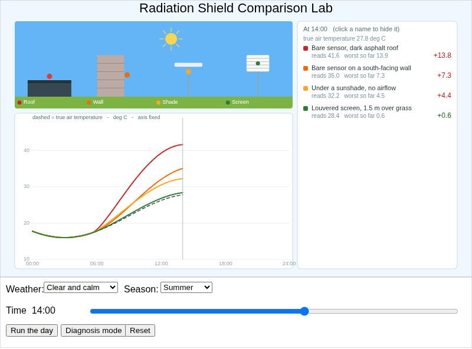Radiation Shield Comparison Lab</a>
  <a href="gpio-pinout-explorer/" title="Raspberry Pi GPIO Pinout Explorer" style="display:block;border:1px solid #e3e7ec;border-radius:8px;overflow:hidden;text-decoration:none;color:inherit;box-shadow:0 1px 3px rgba(0,0,0,0.08);">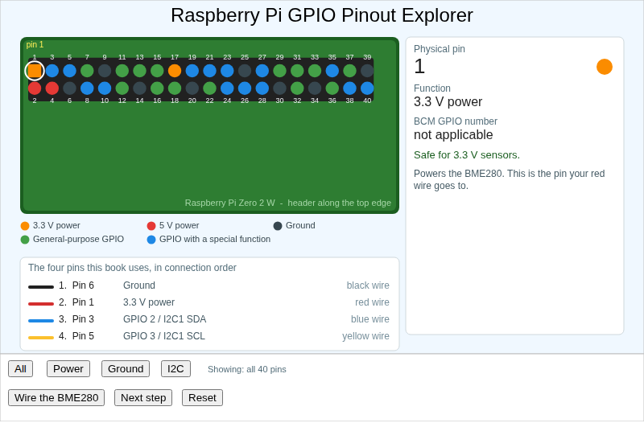Raspberry Pi GPIO Pinout Explorer</a>
  <a href="si-prefix-scale-explorer/" title="SI Prefix and Scale Explorer" style="display:block;border:1px solid #e3e7ec;border-radius:8px;overflow:hidden;text-decoration:none;color:inherit;box-shadow:0 1px 3px rgba(0,0,0,0.08);">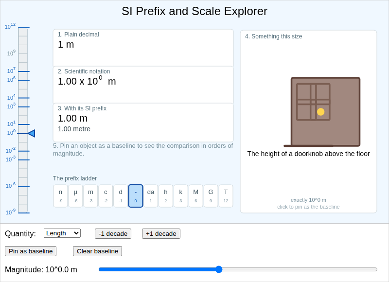SI Prefix and Scale Explorer</a>
  <a href="solar-energy-budget/" title="Solar Constant to Ground: Where the Energy Goes" style="display:block;border:1px solid #e3e7ec;border-radius:8px;overflow:hidden;text-decoration:none;color:inherit;box-shadow:0 1px 3px rgba(0,0,0,0.08);">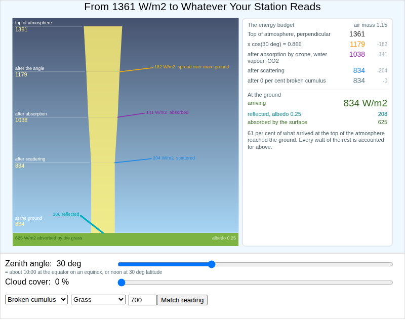Solar Constant to Ground: Where the Energy Goes</a>
  <a href="solar-irradiance-day-explorer/" title="Solar Irradiance Through the Day" style="display:block;border:1px solid #e3e7ec;border-radius:8px;overflow:hidden;text-decoration:none;color:inherit;box-shadow:0 1px 3px rgba(0,0,0,0.08);">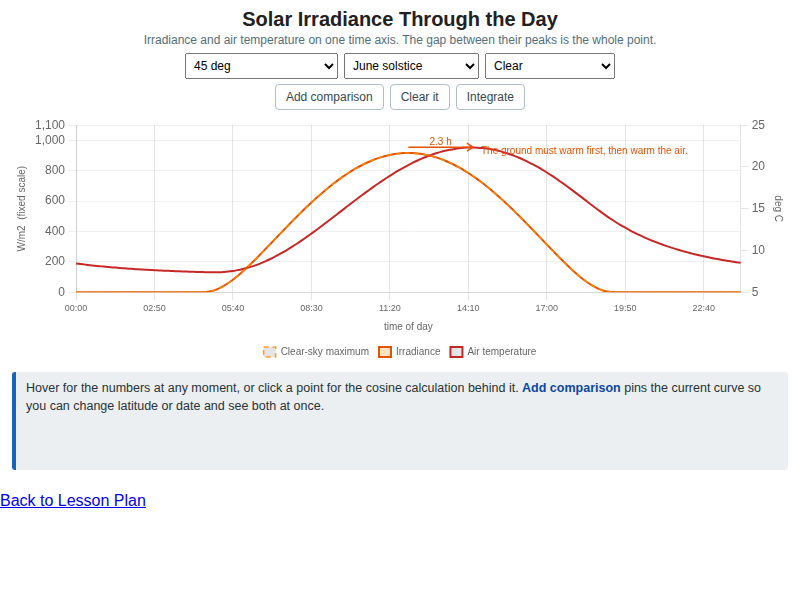Solar Irradiance Through the Day</a>
  <a href="temperature-sensor-comparison/" title="Temperature Sensor Comparison" style="display:block;border:1px solid #e3e7ec;border-radius:8px;overflow:hidden;text-decoration:none;color:inherit;box-shadow:0 1px 3px rgba(0,0,0,0.08);">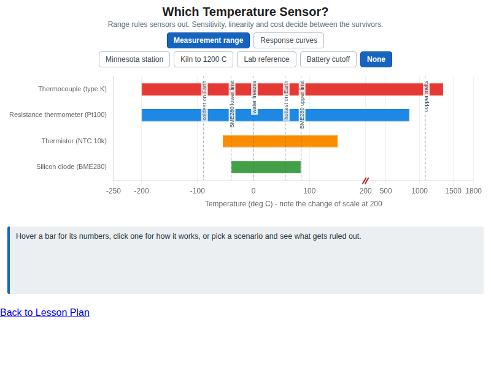Temperature Sensor Comparison</a>
  <a href="longitude-problem-solver/" title="The Longitude Problem Solver" style="display:block;border:1px solid #e3e7ec;border-radius:8px;overflow:hidden;text-decoration:none;color:inherit;box-shadow:0 1px 3px rgba(0,0,0,0.08);">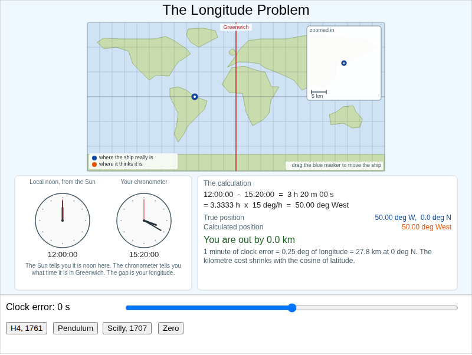The Longitude Problem Solver</a>
  <a href="three-scales-thermometer/" title="Three Scales Thermometer" style="display:block;border:1px solid #e3e7ec;border-radius:8px;overflow:hidden;text-decoration:none;color:inherit;box-shadow:0 1px 3px rgba(0,0,0,0.08);">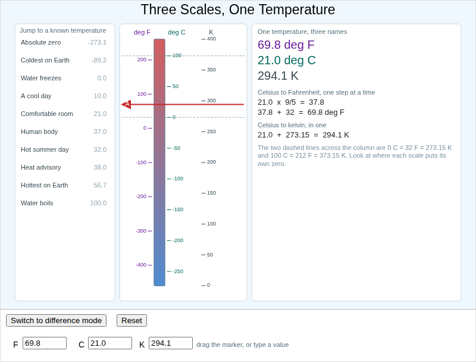Three Scales Thermometer</a>
  <a href="timestamp-trouble-simulator/" title="Timestamp Trouble Simulator" style="display:block;border:1px solid #e3e7ec;border-radius:8px;overflow:hidden;text-decoration:none;color:inherit;box-shadow:0 1px 3px rgba(0,0,0,0.08);">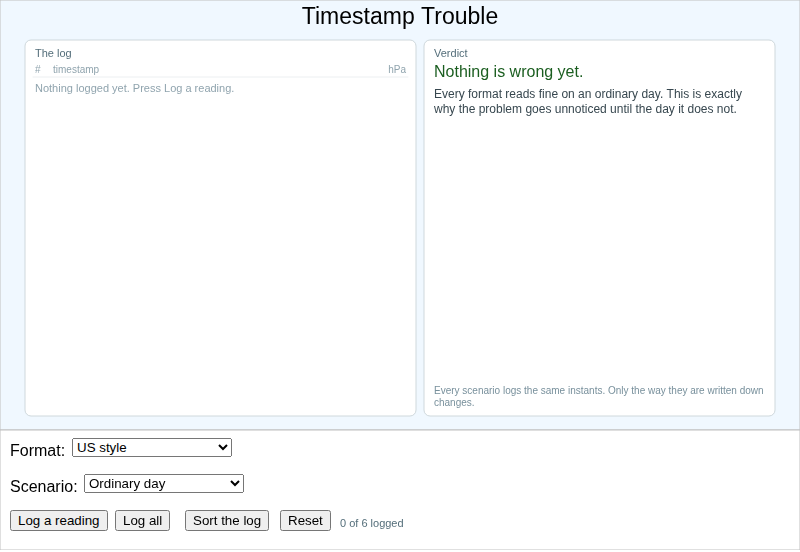Timestamp Trouble Simulator</a>
  <a href="torricelli-puy-de-dome/" title="Torricelli and the Puy de Dome" style="display:block;border:1px solid #e3e7ec;border-radius:8px;overflow:hidden;text-decoration:none;color:inherit;box-shadow:0 1px 3px rgba(0,0,0,0.08);">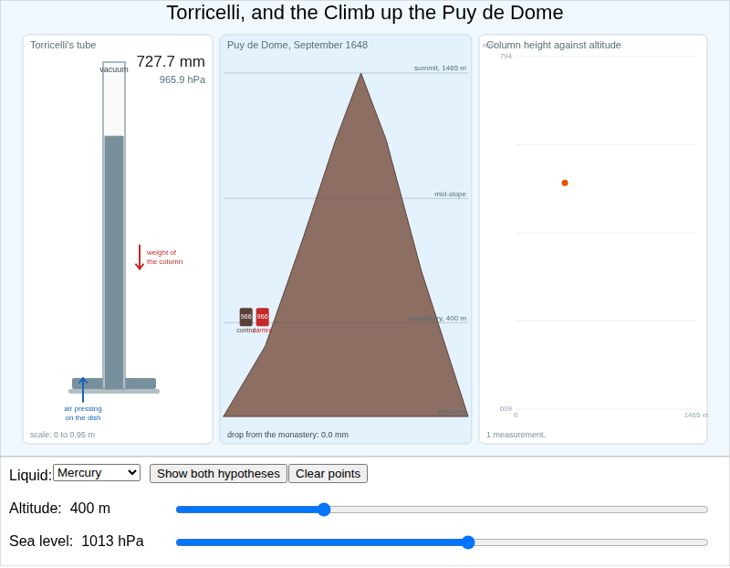Torricelli and the Puy de Dome</a>
  <a href="transduction-mechanism-matcher/" title="Transduction Mechanism Matcher" style="display:block;border:1px solid #e3e7ec;border-radius:8px;overflow:hidden;text-decoration:none;color:inherit;box-shadow:0 1px 3px rgba(0,0,0,0.08);">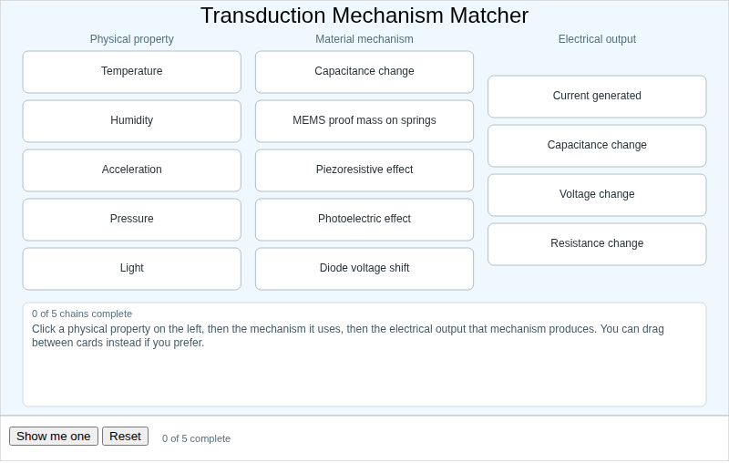Transduction Mechanism Matcher</a>
  <a href="unit-conversion-workbench/" title="Unit Conversion Workbench" style="display:block;border:1px solid #e3e7ec;border-radius:8px;overflow:hidden;text-decoration:none;color:inherit;box-shadow:0 1px 3px rgba(0,0,0,0.08);">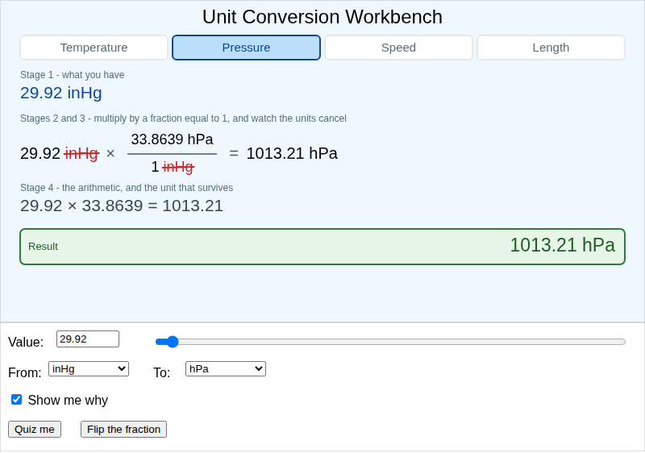Unit Conversion Workbench</a>
  <a href="uv-exposure-estimator/" title="UV Exposure Risk Estimator" style="display:block;border:1px solid #e3e7ec;border-radius:8px;overflow:hidden;text-decoration:none;color:inherit;box-shadow:0 1px 3px rgba(0,0,0,0.08);">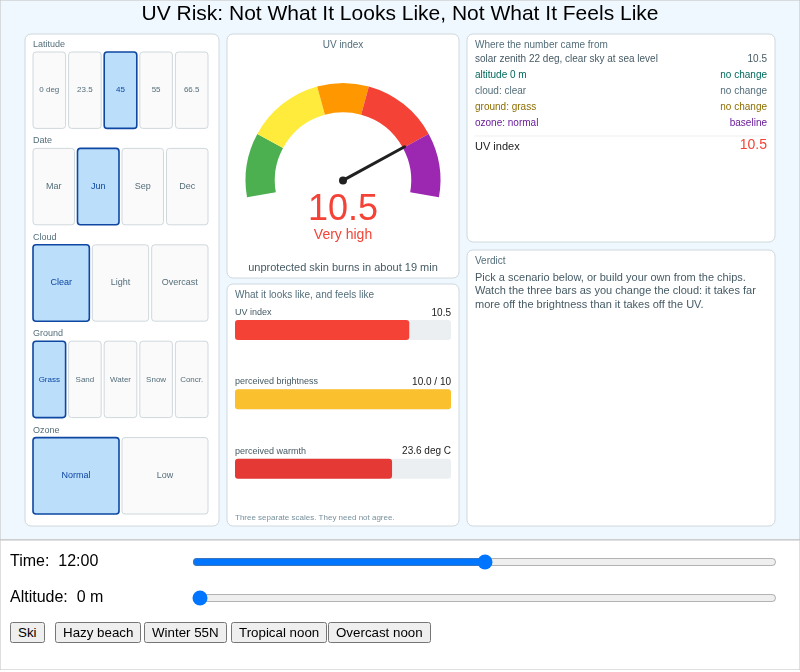UV Exposure Risk Estimator</a>
  <a href="weather-versus-climate-explorer/" title="Weather Versus Climate Explorer" style="display:block;border:1px solid #e3e7ec;border-radius:8px;overflow:hidden;text-decoration:none;color:inherit;box-shadow:0 1px 3px rgba(0,0,0,0.08);">Weather Versus Climate Explorer</a>

